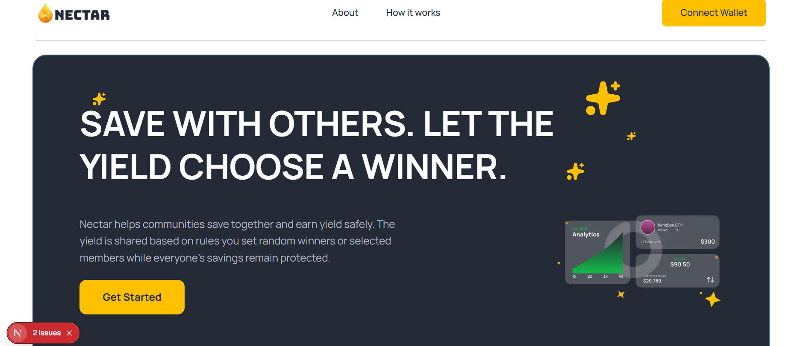
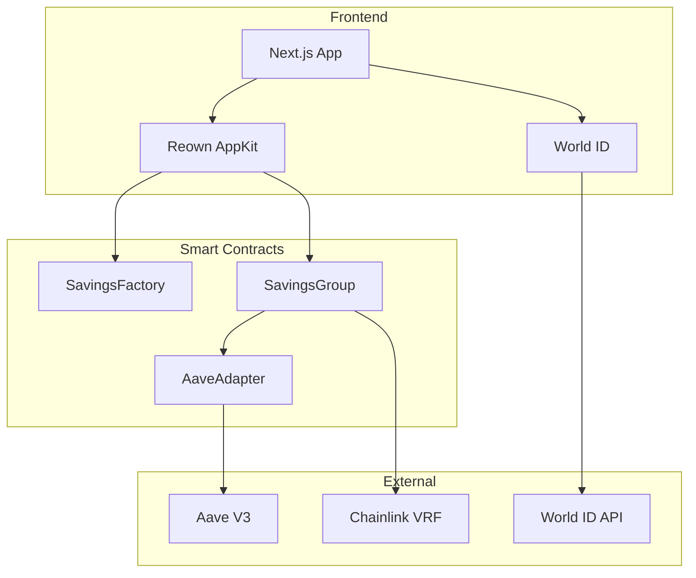
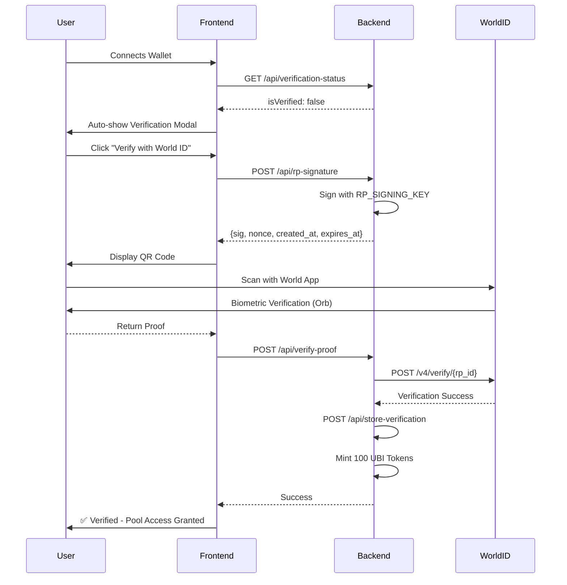

# Nectar 🍯



[](https://opensource.org/licenses/MIT)
[](https://nextjs.org/)
[](https://www.typescriptlang.org/)
[](https://tailwindcss.com/)

**Nectar** is a decentralized savings platform where communities save together, earn yield safely, and share rewards through gamified pools. Built with Next.js 16, TypeScript, and powered by World ID verification for Sybil-resistant UBI distribution.

## 🌟 Features

### Core Features
- 🏦 **Collective Savings Pools** - Create or join community-driven savings groups
- 📈 **Automated Yield Generation** - Earn interest through Aave V3 integration
- 🎰 **Gamified Rewards** - Winners selected via Chainlink VRF (provably fair)
- 🔒 **Principal Protection** - Your deposits are always safe and withdrawable
- 🌉 **Cross-Chain Bridge** - Li.Fi integration for seamless token bridging
- 🆔 **World ID Verification** - Sybil-resistant with biometric proof of personhood
- 💰 **UBI Token Distribution** - Claim Universal Basic Income tokens after verification

### User Experience
- ✨ **Responsive Design** - Optimized for mobile, tablet, and desktop
- 🎨 **Beautiful UI/UX** - Modern interface with Framer Motion animations
- 🔔 **Real-Time Updates** - Live pool stats and member information
- 📊 **Interactive Charts** - Visualize yield performance over time
- 🎴 **3D Flip Cards** - Engaging pool discovery with hover effects

## 📋 Table of Contents

- [Quick Start](#-quick-start)
- [Architecture](#-architecture)
- [Technology Stack](#-technology-stack)
- [Project Structure](#-project-structure)
- [Environment Setup](#-environment-setup)
- [Installation](#-installation)
- [World ID Integration](#-world-id-integration)
- [Key Features](#-key-features)
- [Development](#-development)
- [Deployment](#-deployment)
- [Contributing](#-contributing)

## 🚀 Quick Start

```bash
# Clone the repository
git clone https://github.com/Nectar-GD/frontend.git
cd frontend

# Install dependencies
npm install

# Set up environment variables
cp .env.example .env.local
# Edit .env.local with your credentials

# Run development server
npm run dev
```

Visit [http://localhost:3000](http://localhost:3000) to see the app.

## 🏗️ Architecture



## 🛠️ Technology Stack

### Frontend
- **[Next.js 16](https://nextjs.org/)** - React framework with App Router
- **[TypeScript 5](https://www.typescriptlang.org/)** - Type-safe development
- **[Tailwind CSS 4](https://tailwindcss.com/)** - Utility-first styling
- **[Framer Motion](https://www.framer.com/motion/)** - Smooth animations
- **[Lucide React](https://lucide.dev/)** - Beautiful icon set
- **[Sonner](https://sonner.emilkowal.ski/)** - Toast notifications

### Web3 Integration
- **[Wagmi 2.14](https://wagmi.sh/)** - React hooks for Ethereum
- **[Viem 2.45](https://viem.sh/)** - Lightweight Ethereum library
- **[Reown AppKit 1.8](https://reown.com/)** - WalletConnect integration
- **[World ID SDK](https://docs.world.org/)** - Biometric verification (v4.0)

### Backend Services
- **[Chainlink VRF](https://chain.link/vrf)** - Verifiable randomness
- **[Aave V3](https://aave.com/)** - Yield generation protocol
- **[Pinata IPFS](https://pinata.cloud/)** - Decentralized image storage

## 📂 Project Structure

```
frontend/
├── app/                          # Next.js App Router
│   ├── api/                      # API Routes
│   │   ├── rp-signature/         # World ID RP signature generation
│   │   │   └── route.ts
│   │   ├── verify-proof/         # World ID proof verification
│   │   │   └── route.ts
│   │   ├── verification-status/  # Check user verification
│   │   │   └── route.ts
│   │   └── store-verification/   # Store verification result
│   │       └── route.ts
│   ├── pools/                    # Pools pages
│   │   ├── page.tsx              # Pools listing
│   │   └── [id]/
│   │       └── page.tsx          # Pool details
│   ├── create/
│   │   └── page.tsx              # Create pool page
│   ├── page.tsx                  # Homepage
│   ├── layout.tsx                # Root layout
│   ├── globals.css               # Global styles
│   └── favicon.ico
│
├── components/                   # React Components
│   ├── home/                     # Homepage components
│   │   ├── Features.tsx
│   │   ├── Footer.tsx
│   │   ├── Header.tsx
│   │   └── Hero.tsx
│   ├── Loaders/
│   │   └── LoadingSpinner.tsx
│   ├── pools/                    # Pool components
│   │   ├── NavBar.tsx
│   │   ├── PoolActionForm.tsx
│   │   ├── PoolCard.tsx
│   │   ├── TopNav.tsx
│   │   ├── WalletRouter.tsx
│   │   └── YieldChart.tsx
│   └── verification/             # World ID components
│       ├── AutoVerifyModal.tsx
│       └── VerificationGuard.tsx
│
├── hooks/                        # Custom React Hooks
│   ├── useCreatePool.ts          # Pool creation
│   ├── useEmergencyWithdraw.ts   # Emergency withdrawals
│   ├── useGetAllPools.ts         # Fetch all pools
│   ├── useGetPoolDetails.ts      # Pool details
│   ├── useJoinPool.ts            # Join pool
│   ├── useMyPool.ts              # User's pools
│   ├── usePoolClaim.ts           # Claim rewards
│   ├── usePoolDeposit.ts         # Deposit to pool
│   ├── usePoolMembers.ts         # Pool members
│   ├── usePoolsRegistry.ts       # Pool registry
│   ├── useVaultInfo.ts           # Vault information
│   └── useVerificationStatus.ts  # World ID verification status
│
├── config/
│   └── index.tsx                 # Wagmi configuration
│
├── context/
│   └── index.tsx                 # React context providers
│
├── constant/                     # Constants
│   ├── abi.json                  # Savings pool ABI
│   ├── deposit.json              # Deposit ABI
│   ├── tokenList.json            # Supported tokens
│   └── vault.json                # Vault ABI
│
├── utils/                        # Utility functions
│   ├── decodeContractError.ts
│   └── poolutils.ts
│
├── public/                       # Static assets
│   ├── banner.png
│   ├── logo.png
│   ├── hero-img.png
│   ├── harvestIcon.png
│   ├── users.png
│   ├── yield-chart.png
│   └── ... (other images)
│
├── .env                          # Environment variables (example)
├── .gitignore                    # Git ignore rules
├── eslint.config.mjs             # ESLint configuration
├── next.config.ts                # Next.js configuration
├── package.json                  # Dependencies
├── postcss.config.mjs            # PostCSS configuration
├── tsconfig.json                 # TypeScript configuration
└── README.md                     # This file
```

## 🔐 Environment Setup

Create a `.env.local` file in the project root:

```env
# ===================================
# WALLET CONNECTION (Reown AppKit)
# ===================================
NEXT_PUBLIC_PROJECTID=your_reown_project_id

# ===================================
# WORLDCOIN WORLD ID (v4.0)
# ===================================
NEXT_PUBLIC_WORLDCOIN_APP_ID=app_xxxxxxxxxxxxx
NEXT_PUBLIC_RP_ID=rp_xxxxxxxxxxxxx
NEXT_PUBLIC_WORLDCOIN_ACTION=verify-for-ubi
RP_SIGNING_KEY=sk_xxxxxxxxxxxxx

# ===================================
# PINATA IPFS
# ===================================
NEXT_PUBLIC_PINATA_JWT=your_pinata_jwt_token

# ===================================
# SMART CONTRACTS (ARC Testnet)
# ===================================
NEXT_PUBLIC_SAVINGS_FACTORY=0xE3b1AFA2e09AC4bFA417e118B43f0737C8803940
NEXT_PUBLIC_AAVE_ADAPTER=0x5F67925f67bb556a64e082D2eb88fc5D7De313CD
```

### Getting Credentials

#### **1. Reown Project ID**
1. Visit [Reown Cloud](https://cloud.reown.com/)
2. Create new project
3. Copy Project ID

#### **2. World ID Credentials**
1. Visit [Worldcoin Developer Portal](https://developer.worldcoin.org/)
2. Create new app: "Nectar UBI"
3. Copy:
   - `app_id` (starts with `app_`)
   - `rp_id` (starts with `rp_`)
   - `signing_key` (starts with `sk_` - **keep secret!**)
4. Create action: `verify-for-ubi`

#### **3. Pinata JWT**
1. Visit [Pinata](https://app.pinata.cloud/)
2. Create API key with upload permissions
3. Copy JWT token

## 📥 Installation

### Prerequisites

- **Node.js** 18.x or higher
- **npm** or **yarn**
- **Git**

### Steps

```bash
# 1. Clone repository
git clone https://github.com/Nectar-GD/frontend.git
cd frontend

# 2. Install dependencies
npm install

# 3. Set up environment variables
cp .env.example .env.local
# Edit .env.local with your credentials

# 4. Run development server
npm run dev
```

Open [http://localhost:3000](http://localhost:3000) in your browser.

## 🆔 World ID Integration

Nectar uses **World ID v4.0** for Sybil-resistant verification and UBI distribution.

### Auto-Verification Flow



### Key Features

- ✅ **Auto-trigger** on wallet connect (if not verified)
- ✅ **Biometric proof** via Worldcoin Orb
- ✅ **Sybil resistance** (one person = one verification)
- ✅ **UBI minting** (100 tokens upon verification)
- ✅ **Pool access control** (only verified users can join)
- ✅ **Persistent status** (stored in database)

### Implementation

```typescript
// Auto-verification modal (in app/layout.tsx)
<AutoVerifyModal />

// Protect pool deposits
<VerificationGuard>
  <DepositForm />
</VerificationGuard>

// Check verification status
const { isVerified, isLoading } = useVerificationStatus();

if (isVerified) {
  // User can join pools
}
```

## 🎯 Key Features

### 1. Pool Discovery
Browse all active savings pools with:
- Interactive flip cards (hover to see details)
- Pool stats (members, target, time left)
- Yield performance indicators
- Filter and search (coming soon)

### 2. Pool Details
Comprehensive pool information:
- Real-time member list with addresses
- Yield performance chart (deposits + yield over time)
- Winners selection status
- Time remaining countdown
- Deposit limits and progress

### 3. Create Pool
Launch your own savings pool:
- Customizable parameters (duration, members, winners)
- Token selection (USDC, DAI, etc.)
- IPFS image upload via Pinata
- Yield adapter selection (Aave)

### 4. Deposits & Withdrawals
Secure fund management:
- Min/max deposit validation
- Real-time balance checks
- Transaction confirmation
- Emergency withdrawal option

### 5. Winner Selection
Fair and transparent:
- Chainlink VRF for randomness
- Automatic distribution
- Claim interface for winners
- Winner history tracking

## 💻 Development

### Available Scripts

```bash
# Development
npm run dev          # Start dev server (localhost:3000)
npm run build        # Build for production
npm run start        # Start production server

# Code Quality
npm run lint         # Run ESLint
npm run type-check   # TypeScript type checking
npm run format       # Format with Prettier
```

### Adding New Features

1. **Create component** in `components/`
2. **Add hook** in `hooks/` if needed
3. **Update routes** in `app/`
4. **Test** thoroughly
5. **Update README** with new feature

### Code Style

- Use TypeScript for type safety
- Follow Tailwind utility-first approach
- Write clean, readable code
- Comment complex logic
- Use custom hooks for reusable logic

## 🚢 Deployment

### Vercel (Recommended)

[](https://vercel.com/new/clone?repository-url=https://github.com/Nectar-GD/frontend)

```bash
# Install Vercel CLI
npm i -g vercel

# Deploy to preview
vercel

# Deploy to production
vercel --prod
```

### Environment Variables in Vercel

Add these in **Project Settings → Environment Variables**:

- `NEXT_PUBLIC_PROJECTID`
- `NEXT_PUBLIC_WORLDCOIN_APP_ID`
- `NEXT_PUBLIC_RP_ID`
- `NEXT_PUBLIC_WORLDCOIN_ACTION`
- `RP_SIGNING_KEY` (secret!)
- `NEXT_PUBLIC_PINATA_JWT`

### Build Output

```bash
npm run build

# Output:
# .next/          # Built application
# out/            # Static export (if enabled)
```

## 🧪 Testing

### Manual Testing Checklist

**Homepage:**
- [ ] Hero section loads
- [ ] Features display correctly
- [ ] Responsive on mobile/tablet/desktop

**Wallet Connection:**
- [ ] Connect wallet button works
- [ ] WalletConnect modal appears
- [ ] Multiple wallets supported (MetaMask, Rainbow, etc.)
- [ ] Disconnect works properly

**World ID Verification:**
- [ ] Auto-modal appears on wallet connect (if not verified)
- [ ] QR code displays correctly
- [ ] World App scanning works
- [ ] Verification success updates status
- [ ] UBI tokens minted
- [ ] Modal doesn't reappear after verification

**Pools:**
- [ ] Pools list loads
- [ ] Pool cards flip on hover (desktop)
- [ ] Pool cards clickable on mobile
- [ ] Navigation to pool details works

**Pool Details:**
- [ ] All pool info displays correctly
- [ ] Yield chart renders
- [ ] Member list loads
- [ ] Pagination works (if >5 members)
- [ ] Deposit form validates input
- [ ] Can't join without verification

**Create Pool:**
- [ ] Form validates all inputs
- [ ] Image upload to IPFS works
- [ ] Token selection works
- [ ] Pool creation succeeds
- [ ] Redirects to new pool

## 🤝 Contributing

We welcome contributions! Please follow these guidelines:

### How to Contribute

1. **Fork** the repository
2. **Create** a feature branch
   ```bash
   git checkout -b feature/NewFeature
   ```
3. **Commit** your changes
   ```bash
   git commit -m 'Add some New Feature'
   ```
4. **Push** to the branch
   ```bash
   git push origin feature/NewFeature
   ```
5. **Open** a Pull Request

### Development Guidelines

- Write clean, maintainable TypeScript
- Follow existing code patterns
- Add comments for complex logic
- Test your changes thoroughly
- Update documentation as needed
- Use semantic commit messages

### Reporting Bugs

Open an issue with:
- Clear description
- Steps to reproduce
- Expected vs actual behavior
- Screenshots (if applicable)
- Environment details

## 🗺️ Roadmap

### ✅ Phase 1 (Completed)
- [x] Core savings pools functionality
- [x] Aave V3 yield integration
- [x] Chainlink VRF for winner selection
- [x] World ID v4.0 verification
- [x] Auto-verification on wallet connect
- [x] UBI token minting
- [x] Responsive UI/UX
- [x] Pool creation and management

### 🚧 Phase 2 (Q2 2026)
- [ ] Multi-chain deployment (Ethereum, Polygon, Arbitrum)
- [ ] Advanced pool strategies (flexible duration, recurring)
- [ ] Social features (referrals, pool sharing)
- [ ] Enhanced analytics dashboard
- [ ] Mobile app (React Native)
- [ ] Notification system

### 🔮 Phase 3 (Q3 2026)
- [ ] DAO governance
- [ ] NFT achievements and rewards
- [ ] Lending/borrowing features
- [ ] Insurance integration
- [ ] Cross-protocol yield aggregation
- [ ] Fiat on/off ramps

## 🐛 Known Issues

- World ID simulator may experience delays in staging environment
- Mobile wallet connections sometimes require page refresh
- IPFS uploads can be slow depending on file size
- Chart rendering may lag with large datasets


## 🙏 Acknowledgments

- [Chainlink](https://chain.link/) for VRF infrastructure
- [Aave](https://aave.com/) for yield generation protocol
- [Worldcoin](https://worldcoin.org/) for World ID verification
- [Reown](https://reown.com/) for wallet connection infrastructure
- [OpenZeppelin](https://openzeppelin.com/) for secure smart contract libraries
- The Ethereum and Web3 community

## 📞 Support & Community

- **Website**: [nectar](https://nectar-celo.vercel.app/)
- **GitHub**: [github.com/Nectar-GD](https://github.com/Nectar-GD)


## 🔗 Related Repositories

- **Smart Contracts**: [github.com/Nectar-GD/contracts](https://github.com/Nectar-GD/contracts)


## 📊 Stats

- **Deployed Contracts**: 2 (Factory + Adapter)
- **Supported Chains**: Celo mainnet
- **Components**: 20+
- **Custom Hooks**: 15+
- **Test Coverage**: Growing

---

<div align="center">

**Built with 🍯 by the Nectar team**

**Save Together. Earn Safely. Win Fairly.**

</div>